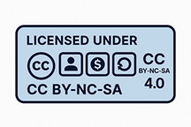

# 🌍 WikiVisas.org


**WikiVisas** is a free, community-curated resource for global migration pathways — including digital nomad visas, work permits, citizenship-by-descent, and investor immigration routes.

Built with ❤️ + 🙏 using [Hugo](https://gohugo.io/) + [CloudCannon](https://cloudcannon.com/) + [GitHub Pages](https://pages.github.com/)

---

## 📂 What You'll Find Here 

- ✅ Starter `.md` templates for country-specific visa programs  
- ✅ Organized folder structure by visa type (e.g. `digital-nomad-visas`, `citizenship-by-investment`)  
- ✅ Placeholder flag icons and country images  
- ✅ CC BY-NC-SA 4.0 License  
- ✅ Visual editing support via CloudCannon CMS  

---

## 🛠 How to Use

Clone or fork the repository, then:

```bash
git clone https://github.com/YOUR_USERNAME/wikivisas-Hugo.git
cd wikivisas-Hugo
```

Start building your Hugo site with:

```bash
hugo server
```

Want to edit visually? Connect to [CloudCannon](https://cloudcannon.com/).

---

## 📄 License

This project is licensed under the **Creative Commons Attribution-NonCommercial-ShareAlike 4.0 International** License (CC BY-NC-SA 4.0).



You may reuse and adapt with attribution. No commercial use allowed.

---

## 🤝 Contributions

We are not accepting public contributions at this time.  
Stay tuned or [follow the project](https://github.com/YOUR_USERNAME/wikivisas-Hugo) for updates.

---

© 2025 WikiVisas.org by Gareth Westwood at OpnLex Legal Labs
